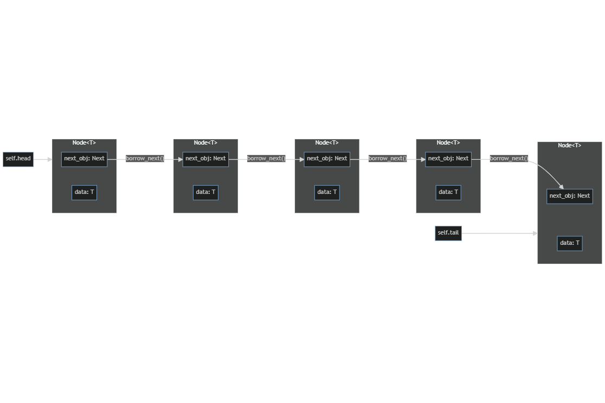

# LinkedList in Rust

Having been learning Rust for a few months now, decided to try out on implementing a simple LinkedList in Rust.

## Static-typed LinkedList

There are many great resources showcasing LinkedList implementations in Rust, for static-typed LinkedList (i.e. `Node<T>` is of a generic type `T`). Implementing LinkedList in Rust is a rather non-trival exercise because:
1. Compiler has to know size of a type.
The snippet below will not work because it is impossible for the compiler to know, at compile time, the size of `Node<T>`. We will need to put `Node<T>` behind a smart pointer, e.g. `Box<T>`, `RefCell<T>`, ...
```rust
// will not work
struct Node<T> {
    data: T,
    next: Option<Node<T>>,
}

// will work
struct Node<T> {
    data: T,
    next: Option<Box<Node<T>>>,
}
```
2. If we want to have a doubly-LinkedList, then we would need `std::rc::Rc` type for reference counting, since by default, Rust only allows a single variable binding to own a data.
3. If we need the `Interior Mutability` pattern, i.e. having the borrowing rules checked at runtime, instead of compile time, then we will need to use `std::cell::RefCell`.

### Resources
1. Tutorials by [Ryan Levick](https://github.com/rylev) on [YouTube](https://www.youtube.com/@RyanLevicksVideos) (excellent teacher for Rust). Two relevant videos are:
   * [LinkedList](https://www.youtube.com/watch?v=IiDHTIsmUi4)
   * [Static vs. Dynamic dispatch](https://www.youtube.com/watch?v=tM2r9HD4ivQ)
2. Hands-on data structures and algorithms with Rust learn programming techniques to build effective, maintainable, and readable code in Rust 2018 by Matzinger, Claus; Chapter titled: Lists, Lists, and More Lists. ([Amazon](https://www.amazon.com/Hands-Data-Structures-Algorithms-Rust-ebook/dp/B07N7D6PG4/))
3. The Complete Rust Programming Reference Guide by Rahul Sharma, Vesa Kaihlavirta and Claus Matzinger; Chapter 14. ([Amazon](https://www.amazon.com/Complete-Rust-Programming-Reference-Guide/dp/1838828109))
4. [Implementing a Linked List in Rust](https://medium.com/swlh/implementing-a-linked-list-in-rust-c25e460c3676)
5. [Learn Rust With Entirely Too Many Linked Lists](https://rust-unofficial.github.io/too-many-lists/)
6. The Rust Book; [Chapter 15](https://doc.rust-lang.org/book/ch15-05-interior-mutability.html) (on `RefCell` and the `Interior Mutability` Pattern)

## Dynamic-typed LinkedList
I implemented (copied) a static-typed LinkedList in `same_type_linked_list.rs` just to check if I got the fundamentals right.

Loving a challenge, I tried to implement a dynamic-typed LinkedList (with two fields, `head` and `tail`, although I didn't implement `pop(&mut self)` from `head` or `tail`.). Just to be sure, by 'dynamic-typed LinkedList', I mean a LinkedList whose nodes are of  different types, e.g.
```raw
node('hello world'): Node<String> -> node(522): Node<u32> -> node(12.34): Node<f32> -> ...
``` 
I have searched the net and there was almost no resource on dynamic-typed LinkedList, which means this could be a good practice.

## Approaches
Table summarizes the modules which contains the successful and unsuccessful approaches.

| Unsuccessful       | Successful                  |
|--------------------|-----------------------------|
| node_traits.rs     | dynamic_type_linked_list.rs |
| dyn_ll_enum.rs     | same_type_linked_list.rs    |
| dyn_ll_idea_two.rs |                             |
|


## The Approach that Worked
After a few tries (which you can read below), the dynamic-typed LinkedList was finally implemented. The solution turns out to be quite straightforward if you happen to know of the `Any` trait in `std::any::Any`. I had originally thought of a similar idea which is to implement a `Data` trait for the field `data`, that will make the struct `Node` purely 'ungeneric', but I had encounter some issues with trait object-safety due to the methods defined associated with the `Next` and `Data` traits. Happy to know that `Any` trait is implemented for almost all primitive traits in the standard library.

struct definitions:
```rust
struct Node {
    data: Box<dyn Any>,
    next: Option<Rc<RefCell<Node>>>,
}

struct DynLinkedList {
    head: Option<Rc<RefCell<Node>>>,
    tail: Option<Rc<RefCell<Node>>>,
    size: u32,
}
```
With these structs, you can implemented methods for them which are almost exactly as that with static-typed LinkedList.
```rust
// example for DynLinkedList's append() method

pub fn append(&mut self, node: Node) {
    let wrapped_node = node.into_wrapped(); // wrapped_node: Rc<RefCell<Node>>
    self.tail.take().map_or_else(
        || self.head = Some(wrapped_node.clone()),
        |old_tail| old_tail.borrow_mut().set_wrapped_next(wrapped_node.clone()),
    ); // set_wrapped_next makes self.tail.next = wrapped_node
    self.tail = Some(wrapped_node);
    self.size += 1;
    }
```
## The Approaches that did not succeed
Not that these approaches would not work, but more of I didn't make these approaches work in the end. These might work eventually with more time invested and research.

### First Try
My first implementation was a disaster.

Tried to have two generic types `<T, U>` and a `pub trait Next` in the implementation of `Node<T, U>`. Soon, I realize that the implementation of `struct DynLinkedList` will be locked to these two generic types and there would be no possibility of say, linking two nodes of the same type consecutively. I have even tried consuming the `DynLinkedList<T, U>` to return say, `DynLinkedList<V, U>`: changing the head. As the return type of functions must be known during compile time, I have to turn to traits and written a trait `DynLinkedListTrait` to be able to write
```rust
fn func_name(func_param: func_param_type) -> impl DynLinkedListTrait
```
After some time, I gave up on this first approach for the second.

### Second Go
Again, a disaster (maybe not).

Tried to decouple the `data` aspect from the `next` aspect of a `Node`.
e.g.
```rust
struct Node<T> {
    data: T,
    next_obj: Next,
}

struct Next {
    next: Option<Rc<RefCell<Next>>>,
}

pub trait CanNext {
    type HasNext: CanNext

    fn borrow_next(&self) -> Option<Ref<Self::HasNext>> {...}

    //other methods...
}
```
So we leave the 'ability' to go 'next' to the `next_obj` field of `Node<T>` instead of giving it to `Node<T>` itself.

Like this:


Still it faces problem when implementing the method `append(&mut self)` for `LinkedList<T, U>`.

```rust
// impl<T, U> DynLinkedList<T, U> { ...
pub fn append<P: Any>(&mut self, node: Node<P>) -> impl DynLLTrait {
    if let Some(old_tail) = self.tail.take() {
        let wrapped_node = node.into_wrapped();
        let old_tail = &mut *old_tail.borrow_mut();
        old_tail.set_next(wrapped_node.clone());

        return DynLinkedListDiffTypes {
          head: self.head.take(),
          tail: Some(wrapped_node),
          kind: SameOrDifferentType::DifferentType,
        }
        
      }
    DynLinkedListDiffTypes::<T, U>::new_with_node(node)
    }
...
```

We are simply not allowed to change head of type Option containing something of type `Node<T>` to that of type `Node<P>` when appending to an empty `DynLinkedList`. You can find the implementation of this unsuccessful approach in `dyn_ll_idea_two.rs`.

## Main Problem with using Generics
I guess the main problem with using generic types to implement dynamic-typed LinkedList is: with the setting of the next node for the tail in that LinkedList, this mutates that LinkedList to a different type. Even with implementing marked trait which I call as `DynLLTrait` and using enums, this approach still does not work for me. You can find the implementation in `dyn_ll_enum.rs`.

# Good things about Rust
I guess this has been a fruitful exercise that spans a few days. Rust is a difficult language to learn. According to [Ryan Levick](https://github.com/rylev), Rust is a "low-level system programming language" with some ideas borrowed from functional programming languages and indeed it is. However, Rust is touted as a very safe, secure, reliable and performant language. One recent example of this is [Discord's switch from Go to Rust](https://discord.com/blog/why-discord-is-switching-from-go-to-rust).

From my readings, I think Rust finds its best successes in blockchain applications, for instance, the highest TPS Layer1 blockchain, Solana, is implemented in Rust. Upcoming [Radix's Scrypto](https://learn.radixdlt.com/article/what-is-scrypto) and the much-anticipated [Sui](https://sui.io/) are also implemented in Rust. Furthermore, the Move language (and its dialects: Aptos, Starcoin and Sui Move) used in smart contracts are compiled, and its syntax is inspired, by Rust.